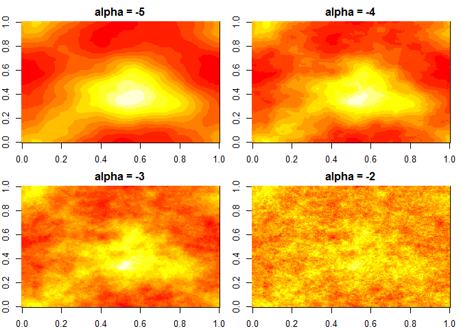

# Gaussian Random Fields simulations in R

```r
library(sparr) # for fft2d (2D Fast-Fourier Wrapper)

fftIndgen = function(n){
  a = seq(0, n/2)
  b = rev(seq(1, n/2-1))
  for (i in 1:length(b)){
    b[i] = -b[i]
  }
  return(c(a,b))
}

Pk2 = function(kx, ky, alpha){
  if (kx == 0 && ky == 0){
    return(0)
  }
  else {
    return(sqrt((sqrt(kx^2+ky^2))^(alpha)))
  }
}

gaussian_random_field = function(alpha, size = 100){
  z = matrix(rnorm(size*size), size, size)
  noise = fft2d(z)
  amplitude = matrix(0, size, size)
  for (i in 1:length(fftIndgen(size))){
    kx = fftIndgen(size)[i]
    for (j in 1:length(fftIndgen(size))){
      ky = fftIndgen(size)[j]
      amplitude[i,j] = Pk2(kx, ky, alpha)
    }
  }
  x = noise * amplitude
  out = Re(fft2d(x, inverse=T))
  return(out)
}

par(mfrow=c(2,2), mar=c(2,2,2,1))
for (alpha in c(-5,-4,-3,-2)){
  set.seed(1)
  image(gaussian_random_field(alpha, size=256), main=paste("alpha =", alpha))
}
```

<!-- -->

